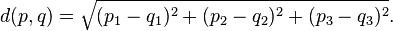

# AnyColourYouLike

_**TODO**_ : Vous devez implanter un programme simple qui utilise l'apprentissage machine pour identifier des couleurs par leur nom.

## Code fourni

Le code a plusieurs classes, celles auquelles vous allez toucher sont :

- AnyColourYouLike.java : main
- ColorLabel : Représentation d'une couleur (r: 0-255, g: 0-255, b: 0-255, name: nom donné à la couleur)
- ColorClassifier : Classe abstraite de classificateur
    - SimpleColorClassifier : Classificateur par la méthode de l'histogramme
    - KNNColorClassifier : Classificateur par la méthode des K plus proches voisins


ColorClassifier définit les méthodes `add` et `colorName`, que vous devrez implanter.


## Étapes du projet

### 0. Familiarisation

Avant de commencer à coder, vous pouvez lancer le programme et vous familiariser avec l'interface. Le Color Picker permet de sélectionner une couleur et de voir son nom en temps réel.

Pour l'instant, ça ne devrait afficher qu'un "?", car les algorithmes n'ont pas été implantés...

Notez le champ d'entrée sous le "?", où vous pourrez ajouter des couleurs arbitraires à l'ensemble de couleurs connues.

Prenez ensuite le temps de lire et de comprendre les classes mentionnées précédement.


### 1. Classification par histogramme

Le premier algorithme à implanter est celui de l'histogramme.

Vous avez (au moins) deux méthodes à implanter dans la classe `SimpleColorClassifier` :

#### a) La méthode add

```java
    public void add(int r, int g, int b, String name) { ... }
```

Cette méthode se chargera d'ajouter une couleur au `this.cube` dans la bonne section selon les valeurs r,g,b passées en paramètre.

Notez que le nombre de sections est une variable, `this.sections` (un `int`).

Notez également que `this.cube[x][y][z]` est un ArrayList de String. On peut donc faire `this.cube[x][y][z].add("Bonjour")` pour ajouter le nom "Bonjour" dans la section (x,y,z).

#### b) La méthode colorName

```java
    public String colorName(int r, int g, int b) { ... }
```

Cette méthode se chargera de donner le nom d'une couleur selon ce qui se trouve dans la section du cube correspondant aux paramètres r, g et b.

*Indice* : Le code de classification dans une section donnée de (r, g, b) va se répéter entre `add` et `colorName`, ça peut être une bonne idée d'en faire une méthode de la classe.

Vous pouvez utiliser la fonction `ColorClassifier.majorityVote(ArrayList<String> arr)` pour obtenir le résultat du vote majoritaire sur un ArrayList de noms de couleurs.

Une fois que votre code fonctionne, vous pouvez le tester sur des plus gros ensembles de données que l'ensemble de base.
[(Voir la section sur les ensembles de données)](#dataset)
    
### 2. Classification par les K plus proches voisins

Le deuxième algorithme à implanter est celui des K plus proches voisins (*K nearest neighbors*).

Encore une fois, vous devrez implanter les deux mêmes méthodes pour la classe `KNNColorClassifier`, en plus d'une méthode de comparaison de deux couleurs qui sera utile :

#### a) La méthode add

Puisqu'on n'a plus à gérer un cube d'ArrayList, le code de cette fonction devrait être plus simple.

La classe possède un ArrayList de ColorLabel, `this.colors`, où vous pouvez simplement stocker les couleurs.

#### b) La méthode de comparaison des couleurs

Cette méthode sera utile pour savoir quels sont les voisins les plus proches d'une couleur donnée.

Vous trouverez dans la classe `ColorLabel` la fonction :

```java
    public int compareTo(ColorLabel other) { ... }
```

Qui devra retourner la distance Euclidienne entre deux couleurs.

Rappelez-vous que les couleurs peuvent être vues comme des vecteurs à 3 valeurs (r, g, b), la formule de la distance sera donc :



Une fois que vous aurez implémenté cette fonction, la méthode `Arrays.sort([array list de ColorLabel])` pourra être utilisée pour trier un ArrayList donné.

#### c) La méthode colorName

Cette méthode sera un peu plus complexe que les autres : vous allez devoir trouver les K plus proches voisins d'une couleur donnée.

Pour cela, vous devrez donc :

1. Parcourir la liste de couleurs connues
2. Garder seulement les `this.k` éléments ayant la plus faible distance avec la couleur inconnue
3. Faire un vote majoritaire des couleurs retenues

### Bonus 1 : K plus proches voisins pondérés

Si vous vous rendez ici en si peu de temps, on a potentiellement sous-estimé vos talents en programmation et en algorithmie...

Essayez de modifier l'algorithme des K plus proches voisins pour tenir compte de la distance de chaque couleur lors du vote !

### Bonus 2 : Votre propre variante

Les K plus proches voisins et les K plus proches voisins pondérés donnent des résultats satisfaisants, mais il y a toujours place à l'amélioration !

Sur le `HugeDataset`, vous remarquez que la performance des algorithmes implantés laisse plutôt à désirer... Essayez de les optimiser pour éviter de refaire en boucle les mêmes calculs.

## Annexes

### Représentation des couleurs

Une couleur est souvent représentée en informatique avec un triplet de `unsigned char` (trois nombres de 0 à 255).

Les nombres représentent respectivement la quantité de *rouge*, de *vert* et de *bleu*. `(r, g, b) => (red, green, blue)`

Les couleurs vont donc de `(0, 0, 0)` (noir) à `(255, 255, 255)` (blanc).

### ArrayLists

En Java, les tableaux sont peu pratiques lorsque vient le temps de manipuler des nombres indéfinis de données. Les `ArrayLists` sont plus pratiques de ce côté :

```
// Création d'un ArrayList pouvant contenir des ColorLabels
ArrayList<ColorLabel> colors = new ArrayList<>();

// Ajout à l'ArrayList
colors.add(new ColorLabel(0, 0, 0, "noir"));
colors.add(new ColorLabel(255, 255, 255, "blanc"));

// On peut itérer sur les éléments d'un ArrayList comme sur un tableau :
for(ColorLabel color : colors) {
    System.out.println(color.name);
}
```


### Ensembles de données

<span id="dataset"></span>

On dispose de trois ensembles de données pour tester les algorithmes :

- SimpleDataset : un ensemble ayant seulement 5 données : Rouge, Vert, Bleu, Blanc et Noir
- BigDataset : Un échantillon de 2700 données d'un ensemble de réponses à un sondage fait sur Internet
- HugeDataset : L'ensemble des données (> 3 millions) du sondage mentionné ci-haut

<small>Référence du sondage : [http://blog.xkcd.com/2010/05/03/color-survey-results/](http://blog.xkcd.com/2010/05/03/color-survey-results/)</small>


Vous remarquerez que le choix de l'ensemble de données change drastiquement les résultats ainsi que la vitesse du programme.


Pour choisir l'ensemble utilisé, changez la classe utilisée dans :


<pre><code>// Fichier : AnyColourYouLike.java
package anycolouryoulike;

public class AnyColorYouLike {

    public static void main(String[] args) {
        Window w = new Window(new SimpleColorClassifier(<b><u>SimpleDataset</u></b>.colors(), 2));
    }

}
</code></pre>

